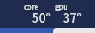
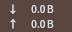

# KDE 配置 

## kde最大化窗口时隐藏标题栏

安装：Active Window Control（在顶栏显示按钮）

参考https://blog.csdn.net/yalin1997/article/details/122711033 在latte-dock 里设置最大化隐藏标题栏

## Plasma 桌面部件

### Thermal Monitor Fix

> https://store.kde.org/p/1408433

### Netspeed Widget

> https://store.kde.org/p/998895

