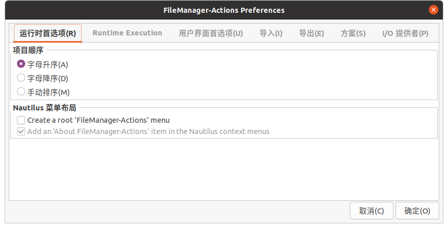
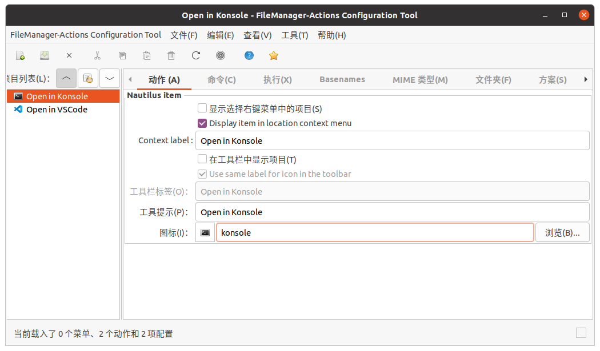
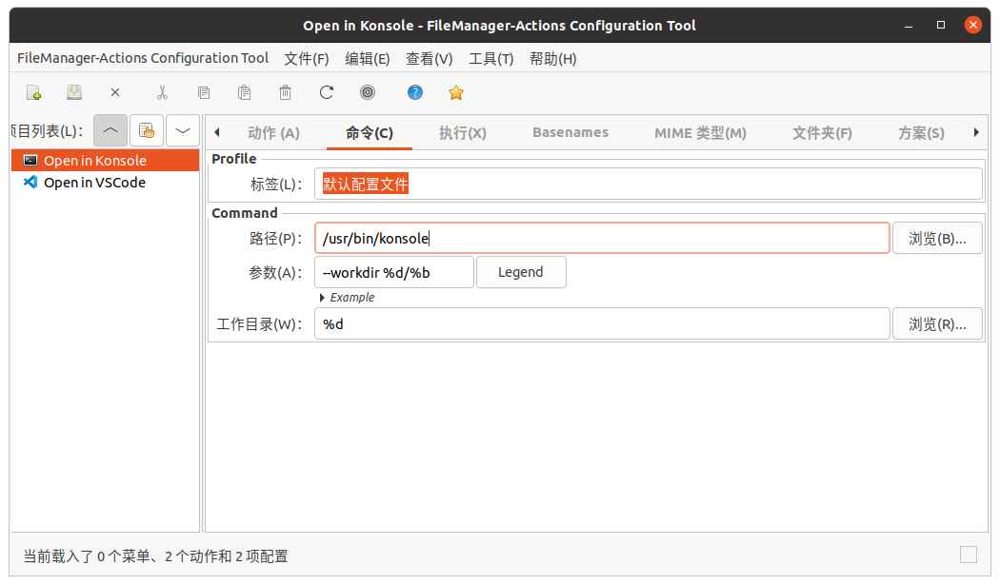
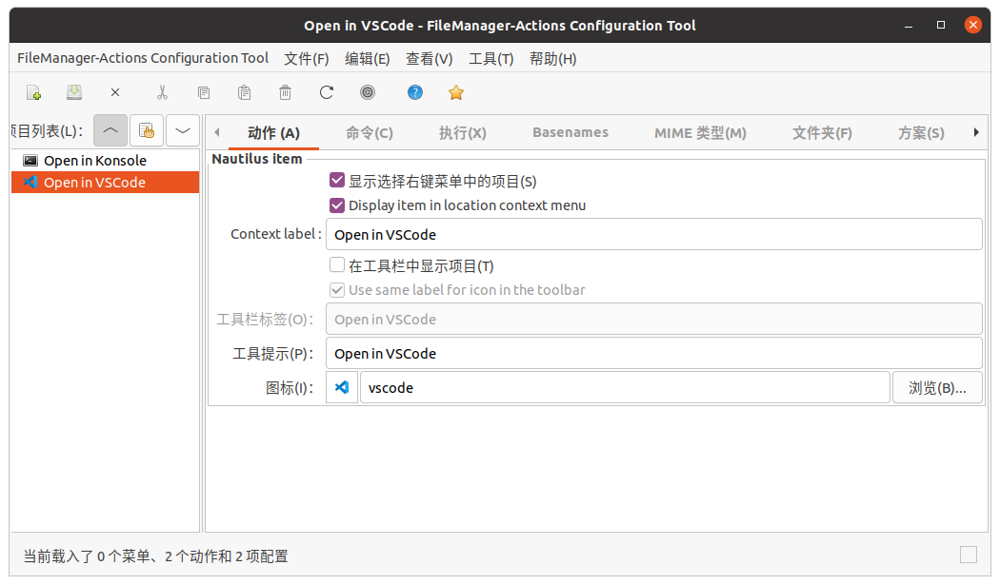
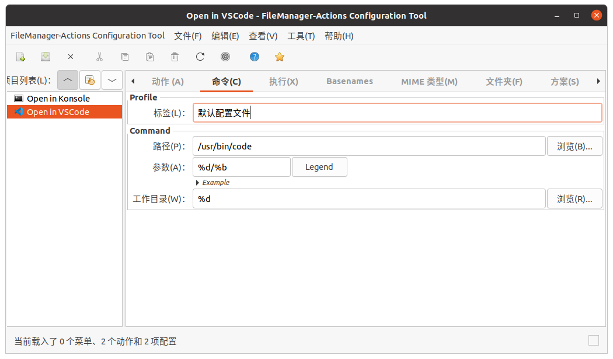

 

# Linux 软件安装

## Proxy

~/.bashrc 或 ~/.zshrc

```shell
proxy_on() {
export http_proxy=http://localhost:1081
export https_proxy=http://localhost:1081
}

proxy_off() {
export http_proxy=http://localhost:1081
export https_proxy=http://localhost:1081
}

proxy_on
```

### Pip 源

```
# 清华源
pip config set global.index-url https://pypi.tuna.tsinghua.edu.cn/simple
# 阿里源
pip config set global.index-url https://mirrors.aliyun.com/pypi/simple/
# 腾讯源(最快)
pip config set global.index-url https://mirrors.cloud.tencent.com/pypi/simple

# 换回默认源
pip config unset global.index-url
```

## 通用

### 字体安装方法

ttf 文件复制到这里：

```
/usr/share/fonts/truetype/<New-Folder>/
```

然后，更新字体缓存：

```
sudo fc-cache -fv
```

这样，你就可以在 Ubuntu 上使用你安装的字体了。你可以用以下命令查看已经安装的字体：

```
fc-list
```

### 输入法(选1个)

#### fcitx5

[fcitx5.md](./fcitx5/fcitx5.md)

#### 搜狗输入法

https://pinyin.sogou.com/linux/?r=pinyin

不显示问题：安装以下依赖

```bash
sudo apt install libqt5qml5 libqt5quick5 libqt5quickwidgets5 qml-module-qtquick2
sudo apt install libgsettings-qt1
```

### 解决 konsole，kate等软件无法切换中文输入法

解决方案（arch）：

修改/etc/profile，增加以下语句：

```shell
#fcitx
export XIM_PROGRAM=fcitx
export XIM=fcitx
export GTK_IM_MODULE=fcitx
export QT_IM_MODULE=fcitx
export XMODIFIERS="@im=fcitx"
```

注销或重启即可解决问题

### v2rayA

> https://v2raya.org/

**安装 v2rayA**

添加公钥

```bash
sudo mkdir /etc/apt/keyrings
wget -qO - https://apt.v2raya.org/key/public-key.asc | sudo tee /etc/apt/keyrings/v2raya.asc
```

添加软件源

```bash
echo "deb [signed-by=/etc/apt/keyrings/v2raya.asc] https://apt.v2raya.org/ v2raya main" | sudo tee /etc/apt/sources.list.d/v2raya.list
sudo apt update
```

安装

```bash
sudo apt install v2raya v2ray
```

**启动**

```bash
sudo systemctl start v2raya.service
```

**设置自动启动**

```bash
sudo systemctl enable v2raya.service
```

**访问**

http://localhost:2017/

### Edge

官网下载安装包

尝试在英文语言下安装，也许会用必应国际作为默认搜索引擎

**如果遇到`GPG error "NO_PUBKEY"`：**

Execute the following commands in terminal

```bash
sudo apt-key adv --keyserver keyserver.ubuntu.com --recv-keys <PUBKEY>
```

where `<PUBKEY>` is your missing public key for repository, e.g. `8BAF9A6F`.

Then update   

```bash
sudo apt-get update
```

**如果遇到Warning: apt-key is deprecated:** 

https://askubuntu.com/questions/1398344/apt-key-deprecation-warning-when-updating-system

### git

```bash
sudo apt install git

git config --global user.email "1023515576@qq.com"
git config --global user.name "X. Y."
git config --global core.quotepath false
```

ssh 目录

> ~/.ssh
>
> /etc/ssh

### Zsh

> https://github.com/ohmyzsh/ohmyzsh/wiki/Installing-ZSH

 Install Zsh:

```bash
sudo apt install zsh
```

Make it your default shell:

```bash
chsh -s $(which zsh)
```

**Log out and log back in again to use your new default shell.**

如果需要临时切换到bash: 

```bash
exec bash
```

#### Oh My Zsh

需要先安装Zsh

```bash
sh -c "$(curl -fsSL https://raw.github.com/ohmyzsh/ohmyzsh/master/tools/install.sh)"
```

#### Theme: powerlevel10k

> https://github.com/romkatv/powerlevel10k

1. Clone the repository:

```bash
git clone --depth=1 https://gitee.com/romkatv/powerlevel10k.git ${ZSH_CUSTOM:-$HOME/.oh-my-zsh/custom}/themes/powerlevel10k
```

2. Set ZSH_THEME="powerlevel10k/powerlevel10k" in ~/.zshrc.

#### 插件

> https://zhuanlan.zhihu.com/p/61447507

```
git clone https://github.com/zsh-users/zsh-autosuggestions ${ZSH_CUSTOM:-~/.oh-my-zsh/custom}/plugins/zsh-autosuggestions
git clone https://github.com/zsh-users/zsh-syntax-highlighting.git ${ZSH_CUSTOM:-~/.oh-my-zsh/custom}/plugins/zsh-syntax-highlighting
```

Edit ~/.zshrc:

```
plugins=(
    git
    z
    zsh-autosuggestions
    zsh-syntax-highlighting
)
```

### tldr

```
pip3 install tldr
```

### Qt Creator

官网下载安装包

如果要换源：
```
./qt-unified-linux-x64-4.5.1-online.run --mirror https://ipv4.mirrors.ustc.edu.cn/qtproject
```

### 视频解码器

> https://linuxhint.com/install-h264-decoder-ubuntu/

直接执行以下命令

（期间会有对话框，前两行命令全选默认的，最后一行接受）

```bash
sudo apt install libdvdnav4 gstreamer1.0-plugins-bad gstreamer1.0-plugins-ugly libdvd-pkg -y
sudo dpkg-reconfigure libdvd-pkg
sudo apt install ubuntu-restricted-extras
```

### samba

参考[samba使用教程.md](../samba/samba使用教程.md)

### .Net 6

```
wget https://packages.microsoft.com/config/ubuntu/20.04/packages-microsoft-prod.deb -O packages-microsoft-prod.deb\nsudo dpkg -i packages-microsoft-prod.deb\nrm packages-microsoft-prod.deb
sudo apt update
sudo apt install dotnet-runtime-6.0
```

## KDE 推荐安装

### language package

```bash 
sudo apt install $(check-language-support)

# 安装中文语言包
sudo apt install language-pack-zh-han*

# 安装gnome包
sudo apt install language-pack-gnome-zh-han*

# 安装kde包
sudo apt install language-pack-kde-zh-han*
```

**zsh使用通配符要加单引号**

> `fcitx-ui-qimpanel `  in $(check-language-support) is confilct with sogoupinyin. Do not install it if using sogoupinyin. 
>
> Some input methods in the list is not needed when using other input methods. 

### Nautilus

```bash
 sudo apt install nautilus nautilus-share
```

### gnome-disk-utility

```bash
sudo apt install gnome-disk-utility
```

### gnome-keyring

```bash
sudo apt install gnome-keyring
```

### yakuake

```bash
 sudo apt install yakuake
```

然后在设置-开机和关机-自动启动里添加启动项

### flameshot 截图工具

> https://github.com/flameshot-org/flameshot

安装：

```
sudo apt install flameshot
```

设置快捷键：

**On KDE Plasma desktop**

To make configuration easier, there's a [file](https://github.com/flameshot-org/flameshot/blob/master/docs/shortcuts-config/flameshot-shortcuts-kde.khotkeys) in the repository that more or less automates this process. This file will assign the following keys to the following actions by default:

| Keys                  | Description                                                  |
| --------------------- | ------------------------------------------------------------ |
| Prt Sc                | Start the Flameshot screenshot tool and take a screenshot    |
| Ctrl + Prt Sc         | Wait for 3 seconds, then start the Flameshot screenshot tool and take a screenshot |
| Shift + Prt Sc        | Take a full-screen (all monitors) screenshot and save it     |
| Ctrl + Shift + Prt Sc | Take a full-screen (all monitors) screenshot and copy it to the clipboard |

If you don't like the defaults, you can change them manually later.

Steps for using the configuration:

1. The configuration file configures shortcuts so that Flameshot automatically saves (without opening the save dialog) screenshots to `~/Pictures/Screenshots` folder. Make sure you have that folder by running the following command:

   ```bash
   mkdir -p ~/Pictures/Screenshots
   ```

   (If you don't like the default location, you can skip this step and configure your preferred directory later.)

2. Download the configuration file:

   ```bash
   cd ~/Desktop
   wget https://raw.githubusercontent.com/flameshot-org/flameshot/master/docs/shortcuts-config/flameshot-shortcuts-kde.khotkeys
   ```

3. Make sure you have the `khotkeys` installed using your package manager to enable custom shortcuts in KDE Plasma.

4. Go to *System Settings* → *Shortcuts* → *Custom Shortcuts*.

5. If there's one, you'll need to disable an entry for Spectacle, the default KDE screenshot utility, first because its shortcuts might collide with Flameshot's ones; so, just uncheck the *Spectacle* entry.

6. Click *Edit* → *Import...*, navigate to the Desktop folder (or wherever you saved the configuration file) and open the configuration file.

7. Now the Flameshot entry should appear in the list. Click *Apply* to apply the changes.

8. If you want to change the defaults, you can expand the entry, select the appropriate action and modify it as you wish; the process is pretty self-explanatory.

9. If you installed Flameshot as a Flatpak, you will need to create a symlink to the command:

   ```bash
   ln -s /var/lib/flatpak/exports/bin/org.flameshot.Flameshot ~/.local/bin/flameshot
   ```

### latte-dock

在 `light-blog-resource/latte-dock-0.10.8` 文件夹中编译安装

然后在`Linux/latte-dock`中使用配置文件

对于0.10.8版本：

布局备份：`TITH-latte10.layout.latte`

面板备份：`TITH-主显示器面板.view.latte`

## GNOME 推荐安装

### komorebi（动态壁纸）

> https://github.com/cheesecakeufo/komorebi

需要安装视频解码器

N卡可能需要使用闭源驱动

### terminator

复制 `.config/terminator` 文件夹到`~/.config`

```bash
sudo apt install terminator
```

### konsole 终端

```
sudo apt install konsole
# 切换默认终端
sudo update-alternatives --config x-terminal-emulator
```

### Gnome 插件

```
sudo apt install gnome-tweak-tool gnome-shell-extensions gnome-shell-extension-prefs gnome-shell-extension-autohidetopbar gnome-shell-extension-dash-to-panel
```

### 剪切板

```
sudo apt install parcellite
```

然后按 `Ctrl`+`Alt`+P 打开设置菜单

### 文件管理器右键菜单

```
sudo apt install nautilus-actions filemanager-actions
```

然后打开 fma-config-tool

(配置完可能需要重启 nautilus 才能生效：`nautilus -q`)

Preference:



**Open in Konsole**





**Open in VSCode**





## 开发

### Miniconda

These four commands quickly and quietly install the latest 64-bit version of the installer and then clean up after themselves. To install a different version or architecture of Miniconda for Linux, change the name of the `.sh` installer in the `wget` command.

```bash
mkdir -p ~/miniconda3
wget https://repo.anaconda.com/miniconda/Miniconda3-latest-Linux-x86_64.sh -O ~/miniconda3/miniconda.sh
bash ~/miniconda3/miniconda.sh -b -u -p ~/miniconda3
rm -rf ~/miniconda3/miniconda.sh
```

After installing, initialize your newly-installed Miniconda. The following commands initialize for bash and zsh shells:

```bash
~/miniconda3/bin/conda init bash
~/miniconda3/bin/conda init zsh
```

取消默认进入 base

```shell
conda config --set auto_activate_base false
```

### ROS

校内源：https://mirrors-help.osa.moe/ros/

官网：http://wiki.ros.org/noetic/Installation/Ubuntu

