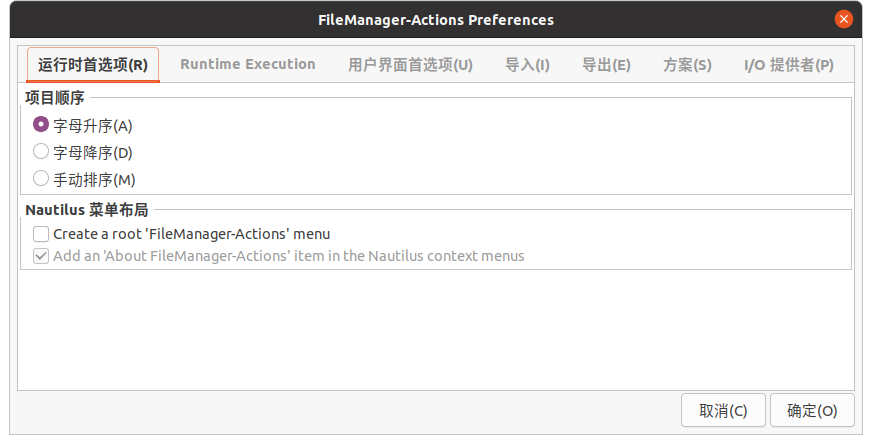
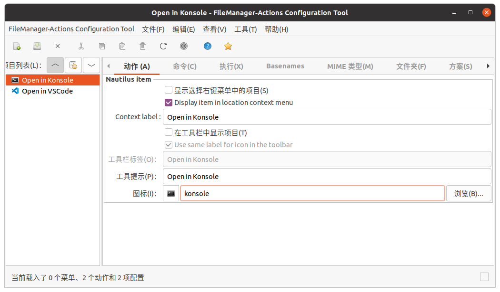
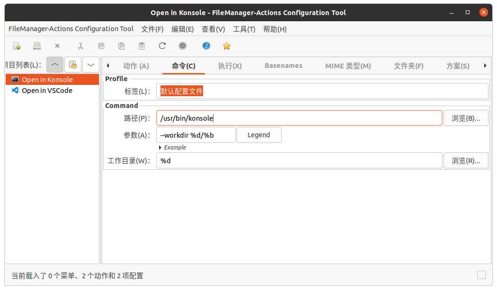
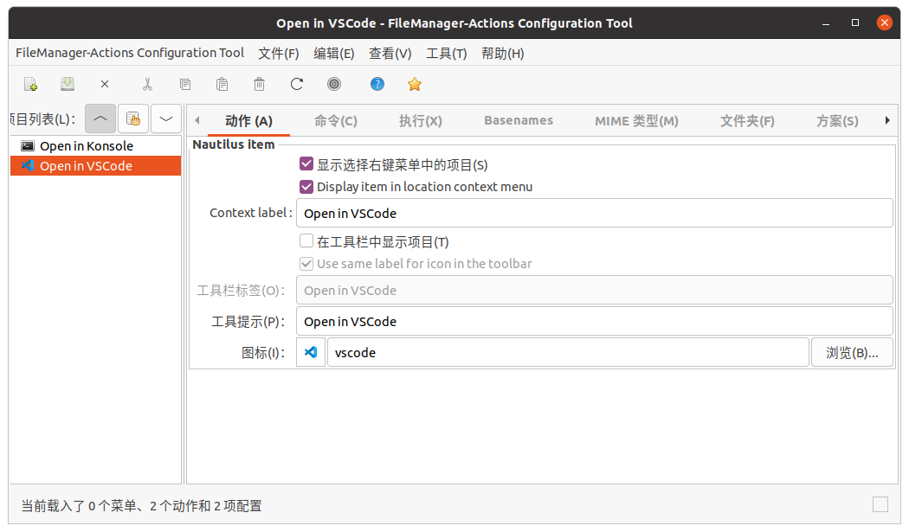
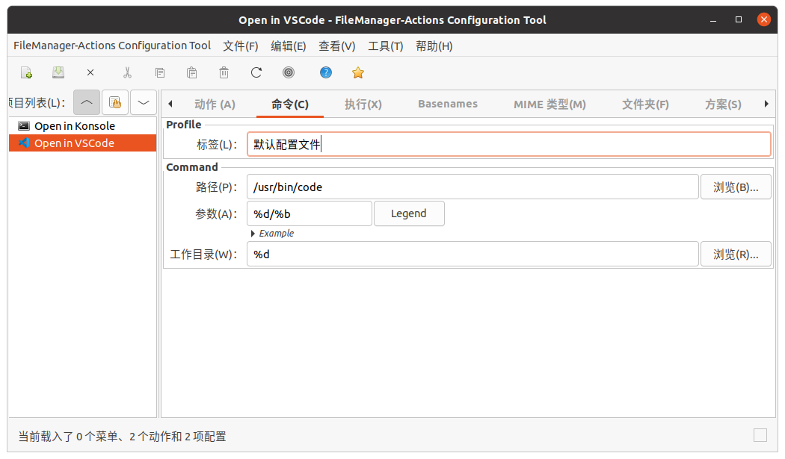

# ubuntu 重装配置

## 修改 efi 位置

1. 删除 /boot/efi/EFI/ubuntu

2. `lsblk` 找到新的 efi 设备分区，如 `nvme1n1p5`

3. `sudo blkid /dev/设备分区` 得到 UUID. 如 `5C51-1F97`

4. 修改 `/etc/fstab` 中 `UUID=XXXX-XXXX /boot/efi vfat umask=0077 0 1` 行，将 `XXXX-XXXX` 换成第 3 步中得到的 UUID

5. 卸载旧分区，挂载新分区： 

   ```shell
   sudo umount /boot/efi
   sudo mount /boot/efi
   ```

6. ```shell
   sudo grub-install
   sudo update-grub
   ```

完成！

## 换源

### APT

>  校内源：https://mirrors-help.osa.moe/ubuntu/

**以下配置适用于 ubuntu 20.04**

- ubuntu 22.04 请将 focal 替换为 jammy
- ubuntu 18.04 请将 focal 替换为 bionic
- ubuntu 16.04 请将 focal 替换为 xenial

```
# https://mirrors.osa.moe/ubuntu/
# https://mirrors.ustc.edu.cn/ubuntu/

# 默认注释了源码镜像以提高 apt update 速度，如有需要可自行取消注释
deb https://mirrors.osa.moe/ubuntu/ focal main restricted universe multiverse
# deb-src https://mirrors.osa.moe/ubuntu/ focal main restricted universe multiverse
deb https://mirrors.osa.moe/ubuntu/ focal-updates main restricted universe multiverse
# deb-src https://mirrors.osa.moe/ubuntu/ focal-updates main restricted universe multiverse
deb https://mirrors.osa.moe/ubuntu/ focal-backports main restricted universe multiverse
# deb-src https://mirrors.osa.moe/ubuntu/ focal-backports main restricted universe multiverse

deb https://mirrors.osa.moe/ubuntu/ focal-security main restricted universe multiverse
# deb-src https://mirrors.osa.moe/ubuntu/ focal-security main restricted universe multiverse

# deb http://security.ubuntu.com/ubuntu/ focal-security main restricted universe multiverse
# # deb-src http://security.ubuntu.com/ubuntu/ focal-security main restricted universe multiverse

# 预发布软件源，不建议启用
# deb https://mirrors.osa.moe/ubuntu/ focal-proposed main restricted universe multiverse
# # deb-src https://mirrors.osa.moe/ubuntu/ focal-proposed main restricted universe multiverse
```

### APT proxy

```shell
sudo nano /etc/apt/apt.conf.d/proxy.conf
```

添加如下

```
Acquire::http::Proxy "http://localhost:1081";
Acquire::https::Proxy "http://localhost:1081";
```

### Pip

```
# HITsz(内网最快)
pip config set global.index-url https://mirrors.osa.moe/pypi/web/simple
# 清华源
pip config set global.index-url https://pypi.tuna.tsinghua.edu.cn/simple
# 阿里源
pip config set global.index-url https://mirrors.aliyun.com/pypi/simple/
# 腾讯源(最快)
pip config set global.index-url https://mirrors.cloud.tencent.com/pypi/simple

# 换回默认源
pip config unset global.index-url
```

## DNS

> https://dns.icoa.cn/

```
119.29.29.29,1.2.4.8

2402:4e00::,240c::6666
```

## 与windows时间同步

(建议修改 windows 端，与 ubuntu 时间同步)

```shell
# 修改 linux 端
timedatectl set-local-rtc 1 --adjust-system-clock
```

## GRUB2 timeout和关机timeout

**GRUB:**

```shell
sudo nano /etc/default/grub
```

Change the value of **GRUB_TIMEOUT**

有时候这不生效，则添加一行：

```
GRUB_RECORDFAIL_TIMEOUT=3
```

Next run:

```shell
sudo update-grub
```

**关机timeout:**

```shell
sudo nano /etc/systemd/system.conf
```

修改为：（注意删掉文件这两行开头的#）

```
DefaultTimeoutStartSec=30s
DefaultTimeoutStopSec=30s
```

执行：

```shell
systemctl daemon-reload
```

## Keychron键盘 F1-F12映射修复

> Ubuntu 22 不需要此操作

```shell
#输入下面命令后，键盘应该能正常使用，但每次重启要重新输入
echo 0 | sudo tee /sys/module/hid_apple/parameters/fnmode
```

```shell
#输入下面的命令，写入配置文件，重启后就无需再次输入
echo "options hid_apple fnmode=0" | sudo tee -a /etc/modprobe.d/hid_apple.conf

#更新initramfs

# Ubuntu
sudo update-initramfs -u 

# ArchLinux
mkinitcpio -P 
```

> 参考自：https://blog.csdn.net/AlanCorn_02/article/details/118462860

## 禁用鼠标键盘唤醒

### 对于G304鼠标：

```shell
sudo cp config_files/config-G304-wakeup.sh /lib/systemd/system-sleep/
sudo chmod +x /lib/systemd/system-sleep/config-G304-wakeup.sh
sudo cp config_files/disable-G304-wakeup.service /etc/systemd/system/
systemctl daemon-reload
systemctl enable disable-G304-wakeup.service
```

### 对于G102鼠标：

```shell
sudo cp config_files/config-G102-wakeup.sh /lib/systemd/system-sleep/
sudo chmod +x /lib/systemd/system-sleep/config-G102-wakeup.sh
sudo cp config_files/disable-G102-wakeup.service /etc/systemd/system/
systemctl daemon-reload
systemctl enable disable-G102-wakeup.service
```

### 对于其他鼠标：

1. **找到相关设备**

```shell
lsusb
```

>  例如：`Bus 005 Device 003: ID 046d:c53f Logitech, Inc. USB Receiver`
>
> 其中ID格式为：`idVendor:idProduct`

2. **修改脚本**

修改`config-G304-wakeup.sh`脚本中的id（并换个文件名）

**这两行换成在步骤1中查到的id**

```shell
idVendor=046d
idProduct=c53f
```

修改`disable-G304-wakeup.service`中的对应信息（并换个文件名）

3. **部署脚本**

```shell
sudo cp config-新名字-wakeup.sh /lib/systemd/system-sleep/
sudo chmod +x /lib/systemd/system-sleep/config-新名字-wakeup.sh
sudo cp disable-新名字-wakeup.service /etc/systemd/system/
systemctl daemon-reload
systemctl enable disable-新名字-wakeup.service
```

## reboot-to-ubuntu.sh

```shell
mkdir -p ~/.local/bin/
cp reboot-to-ubuntu.sh ~/.local/bin/
```

> 参考自：https://askubuntu.com/a/713247

## 开机挂载硬盘

仿照如下修改 fstab

或者直接使用 gnome-disk-utility 配置 `sudo apt install gnome-disk-utility`

另外 kubuntu 22.04 自带的 KDE 分区管理器也好用（20.04的似乎不好用）

```
# /etc/fstab: static file system information.
#
# Use 'blkid' to print the universally unique identifier for a
# device; this may be used with UUID= as a more robust way to name devices
# that works even if disks are added and removed. See fstab(5).
#
# <file system>                             <mount point>        <type> <options>     <dump>  <pass>
# / was on /dev/nvme1n1p6 during installation
UUID=bc37ee02-3ac4-44da-b6ad-34f43a80673b   /                    ext4   errors=remount-ro       0 1 
# /boot/efi was on /dev/nvme1n1p5 during installation
UUID=5C51-1F97                              /boot/efi            vfat   umask=0077              0 1 
# swap was on /dev/nvme1n1p4 during installation
UUID=4b888711-6ff2-480f-9615-700ec0e7a8c4   none                 swap   sw                      0 0 
UUID=f4bc711c-5c5e-40e0-92e5-38a351d20f43   /mnt/ubuntu          ext4   defaults                0 0 
UUID=7080BF8880BF5378                       /mnt/win_e           ntfs   defaults,windows_names  0 0 
UUID=7C506F8E506F4DC8                       /mnt/win_d           ntfs   defaults,windows_names  0 0 
/mnt/ubuntu/home/xy/Documents               /home/xy/Documents   none   bind                    0 0
/mnt/ubuntu/home/xy/Downloads               /home/xy/Downloads   none   bind                    0 0
/mnt/ubuntu/home/xy/Music                   /home/xy/Music       none   bind                    0 0
/mnt/ubuntu/home/xy/Pictures                /home/xy/Pictures    none   bind                    0 0
/mnt/ubuntu/home/xy/Videos                  /home/xy/Videos      none   bind                    0 0
```

## locate 命令 updatedb 搜索路径配置

> ubuntu 22.04 有效，ubuntu 20.04 无效

/etc/updatedb.conf

```properties
PRUNE_BIND_MOUNTS="no"
# PRUNENAMES=".git .bzr .hg .svn"
PRUNEPATHS="/tmp /var/spool /media /mnt /var/lib/os-prober /var/lib/ceph /home/.ecryptfs /var/lib/schroot"
PRUNEFS="NFS afs autofs binfmt_misc ceph cgroup cgroup2 cifs coda configfs curlftpfs debugfs devfs devpts devtmpfs ecryptfs ftpfs fuse.ceph fuse.cryfs fuse.encfs fuse.glusterfs fuse.gvfsd-fuse fuse.mfs fuse.rclone fuse.rozofs fuse.sshfs fusectl fusesmb hugetlbfs iso9660 lustre lustre_lite mfs mqueue ncpfs nfs nfs4 ocfs ocfs2 proc pstore rpc_pipefs securityfs shfs smbfs sysfs tmpfs tracefs udev udf usbfs"
```

## Kubuntu 休眠按钮

> kubuntu 22.04 测试成功

1. 启用休眠功能（忘记怎么做了，建议上网搜）

2. ```shell
   sudo -i
   cd /var/lib/polkit-1/localauthority/50-local.d/
   vim com.ubuntu.enable-hibernate.pkla
   ```

3. 粘贴：

   ```shell
   [Re-enable hibernate by default in upower]
   Identity=unix-user:*
   Action=org.freedesktop.upower.hibernate
   ResultActive=yes
   [Re-enable hibernate by default in logind]
   Identity=unix-user:*
   Action=org.freedesktop.login1.hibernate
   ResultActive=yes
   ```

4. 保存并重启

## v2rayA

官网：https://v2raya.org

Ubuntu安装方法：https://v2raya.org/docs/prologue/installation/debian/

安装完成后访问：http://localhost:2017

## 字体安装方法

KDE 直接右键批量安装

Gnome 似乎不能批量安装，只能手动安装

#### 手动安装

ttf 文件复制到这里：

```
/usr/share/fonts/truetype/<New-Folder>/
```

然后，更新字体缓存：

```
sudo fc-cache -fv
```

这样，你就可以在 Ubuntu 上使用你安装的字体了。你可以用以下命令查看已经安装的字体：

```
fc-list
```

## git

```shell
sudo apt install git

git config --global user.email "1023515576@qq.com"
git config --global user.name "X. Y."
git config --global core.quotepath false
```

ssh 目录

> ~/.ssh
>
> /etc/ssh

## Zsh

Install Zsh:

```shell
sudo apt install zsh
```

Make it your default shell:

```shell
chsh -s $(which zsh)
```

Log out and log back in again to use your new default shell.

如果需要临时切换到bash: 

```shell
exec bash
```

### Oh My Zsh

```shell
sh -c "$(curl -fsSL https://raw.github.com/ohmyzsh/ohmyzsh/master/tools/install.sh)"
```

### Theme: powerlevel10k

1. Clone the repository:

```shell
git clone --depth=1 https://gitee.com/romkatv/powerlevel10k.git ${ZSH_CUSTOM:-$HOME/.oh-my-zsh/custom}/themes/powerlevel10k
```

2. Set ZSH_THEME="powerlevel10k/powerlevel10k" in ~/.zshrc.

### 插件

```shell
git clone https://github.com/zsh-users/zsh-autosuggestions ${ZSH_CUSTOM:-~/.oh-my-zsh/custom}/plugins/zsh-autosuggestions
git clone https://github.com/zsh-users/zsh-syntax-highlighting.git ${ZSH_CUSTOM:-~/.oh-my-zsh/custom}/plugins/zsh-syntax-highlighting
```

Edit ~/.zshrc:

```
plugins=(
    git
    z
    zsh-autosuggestions
    zsh-syntax-highlighting
)
```

## xyrc

```shell
cp xyrc ~/.local/
```

然后在 .zshrc 和 .bashrc 中添加 `source $HOME/.local/xyrc`

### 

## 输入法

### kununtu 22.04：建议 fcitx5

直接安装 [language package](#language-package)，这会默认帮你安装 fcitx5

之后重启系统，在系统设置的输入法界面添加 Pinyin 输入法（不是 Keyboard - Chinese）

### kubuntu 20.04：建议搜狗输入法

https://pinyin.sogou.com/linux/?r=pinyin

搜狗输入法不显示问题：安装以下依赖

```shell
sudo apt install libqt5qml5 libqt5quick5 libqt5quickwidgets5 qml-module-qtquick2
sudo apt install libgsettings-qt1
```

解决 konsole，kate等软件无法切换中文输入法：

修改/etc/profile，增加以下语句：

```shell
#fcitx
export XIM_PROGRAM=fcitx
export XIM=fcitx
export GTK_IM_MODULE=fcitx
export QT_IM_MODULE=fcitx
export XMODIFIERS="@im=fcitx"
```

注销或重启即可解决问题

### ubuntu 20.04：建议系统自带的

## language package

注意：以下命令建议全部安装（如果使用搜狗输入法，则记得卸载 `fcitx-ui-qimpanel`，因为它与搜狗输入法冲突）

```shell
sudo apt install $(check-language-support)

# 安装中文语言包
sudo apt install 'language-pack-zh-han*'

# 安装gnome包
sudo apt install 'language-pack-gnome-zh-han*'

# 安装kde包
sudo apt install 'language-pack-kde-zh-han*'
```

# 一些软件

## Edge

官网下载安装包

尝试在英文语言下安装，也许会用必应国际作为默认搜索引擎

```
{bing:baseURL}search?q=%s&{bing:cvid}{bing:msb}{google:assistedQueryStats}
```

**如果遇到`GPG error "NO_PUBKEY"`：**

Execute the following commands in terminal

```shell
sudo apt-key adv --keyserver keyserver.ubuntu.com --recv-keys <PUBKEY>
```

where `<PUBKEY>` is your missing public key for repository, e.g. `8BAF9A6F`.

Then update   

```shell
sudo apt-get update
```

**如果遇到 Warning: apt-key is deprecated:** 

https://askubuntu.com/questions/1398344/apt-key-deprecation-warning-when-updating-system

## samba

[samba使用教程.md](../samba/samba使用教程.md)

## 其他软件

```shell
sudo apt install gnome-disk-utility
sudo apt install gnome-keyring
sudo apt install yakuake
pip3 install tldr
sudo apt install flameshot # https://github.com/flameshot-org/flameshot
```

## 视频解码器

**建议仅在需要时安装**

直接执行以下命令，期间会有对话框，前两行命令全选默认的，最后一行接受

```shell
sudo apt install libdvdnav4 gstreamer1.0-plugins-bad gstreamer1.0-plugins-ugly libdvd-pkg -y
sudo dpkg-reconfigure libdvd-pkg
sudo apt install ubuntu-restricted-extras
```

> 参考自：https://linuxhint.com/install-h264-decoder-ubuntu/

## Gnome桌面环境推荐额外安装：

### konsole 终端

```
sudo apt install konsole
# 切换默认终端
sudo update-alternatives --config x-terminal-emulator
```

### Gnome 插件

```
sudo apt install gnome-tweak-tool gnome-shell-extensions gnome-shell-extension-prefs gnome-shell-extension-autohidetopbar gnome-shell-extension-dash-to-panel
```

### 剪切板

```
sudo apt install parcellite
```

然后按 `Ctrl`+`Alt`+P 打开设置菜单

### 文件管理器右键菜单

```
sudo apt install nautilus-actions filemanager-actions
```

然后打开 fma-config-tool

(配置完可能需要重启 nautilus 才能生效：`nautilus -q`)

Preference:




**Open in Konsole**





**Open in VSCode**






# Bugs

## KDE Dolpnin 无法访问 Windows 共享文件夹

报错：The file or folder smb://ip does not exist.

A user on Reddit found a fix: In System Settings–>Network Settings–>Windows Shares, add ANY text to the user and password fields and restart Dolphin. Now I get a password prompt and can view and mount shares.

> https://forum.manjaro.org/t/dolphin-the-file-or-folder-smb-sharename-does-not-exist/114900/10

## update-grub 不会找到其他 btrfs 分区中的 linux

The GRUB os-prober has problems detecting btrfs @subvolumes, the easiest answer from "rick3332" from ubuntu-forums made it work for me on both dual-boot btrfs based OS installs(ubuntu16&18) each with their own grub. There is no need for comprehensive hack os-prober code or do non-persistent manual grub.cfg edits. Just create symlinks in each btrfs volume roots for @/boot and @/etc and run "sudo update-grub2" afterwards in each OS.

```shell
#navigate to root of your current booted brtfs based OS
cd /
#create symlink for boot
ln -s @/boot boot
#create symlink for etc
ln -s @/etc etc

#mount the other btrfs volume with OS-install and navigate to its root
cd /mnt/exampleotherbtrfsvolume
#create symlink for boot
ln -s @/boot boot
#create symlink for etc
ln -s @/etc etc

#let grub detect btrfs based install volume
sudo update-grub2

#reboot to the other btrfs based OS (probably listed this time in grubmenu)
#let this grub detect the previously booted btrfs volume
sudo update-grub2
```

> 参考自：https://askubuntu.com/a/1032354
