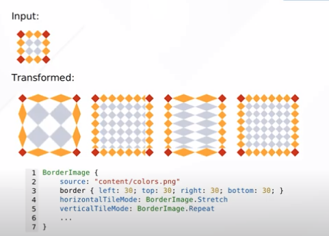
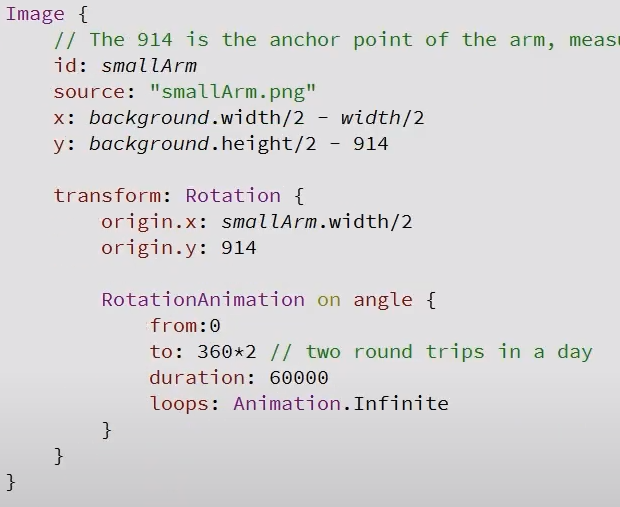
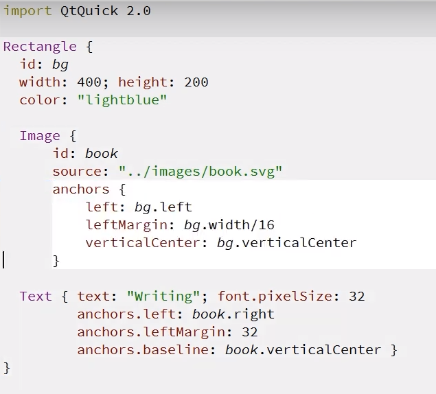
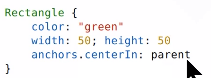

# 	QML note

## function

```javascript
function foo() {
    console.log("hello world", height)
    return height * 2
}
```

## Rectangle

```javascript
Rectangle {
	x: 100;y: 120; z: -1 // z 可以理解为图层
    width: 300
    height: 100
    opacity: 0.5 // 不透明度
}
```

## Image

```javascript
Image {
    x:150; y: 150
    source: "../images/a.png"
}
```

### 缩放

```javascript
// 基于原图像的缩放，会改变对象实际尺寸
width: sourceSize.width * 2 
height: sourceSize.height * 2
```

```javascript
//缩放，但不会改变该对象的实际尺寸，只是看起来缩放了
scale: 2.0
```

### 旋转

```javascript
rotation: 45.0 // 单位°
transformOrigin: Item.TopLeft // 旋转中心，只能指定特定点
```

指定任意旋转中心：

```
transform: Rotation{
            origin.x: width / 2
            origin.y: height / 10
            angle: 45
        }
```

## BorderImage



## 旋转动画



## Anchor Layout





## Mouse and Touch

 ```javascript
 MouseArea {}
 Flickable {} // 滑动
 PinchArea {} // jia
 ```

