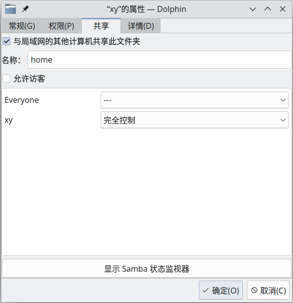

# samba 使用教程

## 软件安装和配置

### Manjaro Linux

> 参考自：https://wiki.archlinux.org/title/Samba

```shell
# 安装
sudo pacman -S samba

# 配置 smb.conf
sudo cp manjaro_smb.conf /etc/samba/smb.conf

# 添加用户
# 此处可能提示输入两种密码，请仔细检查：
# sudo 密码：Linux 管理员密码
# New SMB password：Samba 共享密码，可与 Linux 管理员密码不同
sudo smbpasswd -a $USER

# Enable Usershares
# 之后可以直接在 Dolphin 文件管理器中右键共享文件夹
sudo mkdir /var/lib/samba/usershares
sudo groupadd -r sambashare
sudo chown root:sambashare /var/lib/samba/usershares
sudo chmod 1770 /var/lib/samba/usershares
sudo gpasswd sambashare -a $USER

# 设置开机自启
sudo systemctl enable smb

# 启动
sudo systemctl start smb

# (Optional) Make your server accessible via NetBIOS host name
sudo systemctl start nmb
sudo systemctl enable nmb
```

### Ubuntu

1. 安装

    ```shell
    # 安装
    sudo apt install samba
    
    # 添加用户
    # <用户名> 必须是 Linux 系统中的用户名
    # 之后提示输入 New SMB password，此处的密码可与系统密码不同
    sudo smbpasswd -a <用户名>
    ```

2. 配置 smb.conf

    在 /etc/samba/smb.conf 的 [global] 下添加：

    ```shell
    # 共享 owner 不是自己的文件，比如 NTFS 磁盘
    usershare owner only = false
    # 允许软链接
    unix extensions = No
    follow symlinks = Yes
    wide links = Yes
    ```

3. 重启 samba

    ```shell
    sudo service smbd restart
    ```

## 其他配置

### 添加共享文件夹

KDE Manjaro 可以直接在 Dolphin 文件管理器中右键添加：



KUbuntu 应该也行，但可能由于版本较低，不好用

有时候可能会弹出下面的提示，可以不用管它


### 用户别名

With Samba 3.0.25, you can use the non-SAM account aliases of AD Bridge by including a user name map:

- Add `username map = /etc/samba/users.map` to the global section of smb.conf.
- Create an /etc/samba/users.map file.
- In the users.map file, add an entry for each aliased user in the following form: !alias = DOMAIN\user. (例如：`xy = xieyang`)

To make an alias for an Active Directory group, use the form !alias = @DOMAIN\group. The exclamation point triggers Samba to stop processing on the first matching alias, preventing issues with multiple alias matches from wildcards.

### 文件位置

共享目录记录位置：/var/lib/samba/usershares

smb.conf文件位置：/etc/samba/smb.conf

>  注：建议在 usershares 中添加要共享的目录信息

## 常见问题

### net usershare”返回错误 255

在`smb.conf`的 [global]下添加：

```
usershare owner only = false
```

> net usershare add: cannot share path /mnt/E/_XY as we are restricted to only sharing directories we own.
> 	Ask the administrator to add the line "usershare owner only = false" 
> 	to the [global] section of the smb.conf to allow this.

### 软链接支持

在[global]下添加：

```
unix extensions = No
follow symlinks = Yes
wide links = Yes
```

### daemon failed to start: Samba cannot init registry

https://blog.csdn.net/u013310025/article/details/86721604

```bash
sudo rm /var/lib/samba/registry.tdb
```

